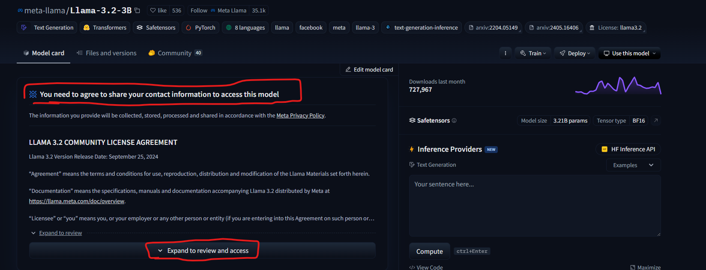
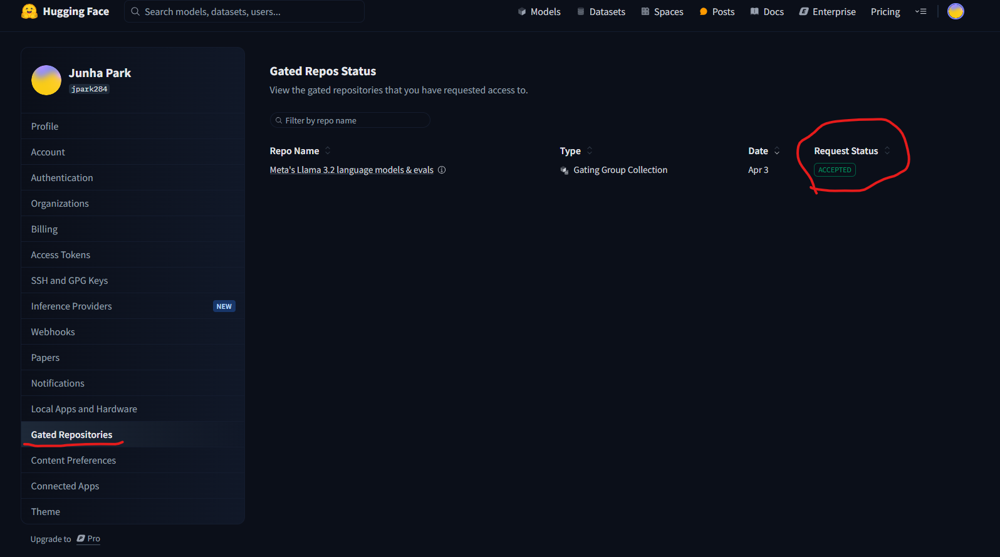
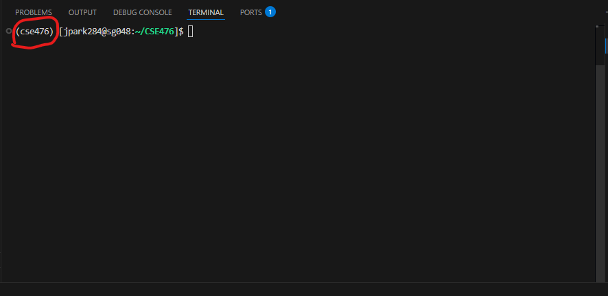

# python environment setting

## following bash commands should be executed in the project file

### 1. cp ./cse476.yaml ~/cse476.yaml
### 2. cd ~
### 3. module load mamba/latest
### 4. mamba env create -n cse476 --file ~/cse476.yaml
### 5. source activate cse476

# huggingface transformers setting
### 1. Create Account for Huggingface
### 2. Grant Access for llama-3.2-3b (takes like 10min to get access)

    you can check request status(setting -> Gated Repo)

### 3. Get HuggingFace Access Token (Setting -> Get Access Token)
### 4. copy config_temp.py to config.py (cp ./Backend/config_temp.py ./Backend/config.py)
### 4. Copy and paste your Access Token to config.py

# Dependency library install
### 1. Once you successfully open python environment you will have (cse476) in your terminal

### 2. Now you can download dependency library to run the code.
### 3. pip install -r requirements.txt
### 4. Once download is completed, you are ready to run code

# Test LLM API
### 1. open 2 terminals
### 2. python main.py (1st terminal) (this is llm api server)
### 3. python test_llm.py (2nd terminal) (this is client)

