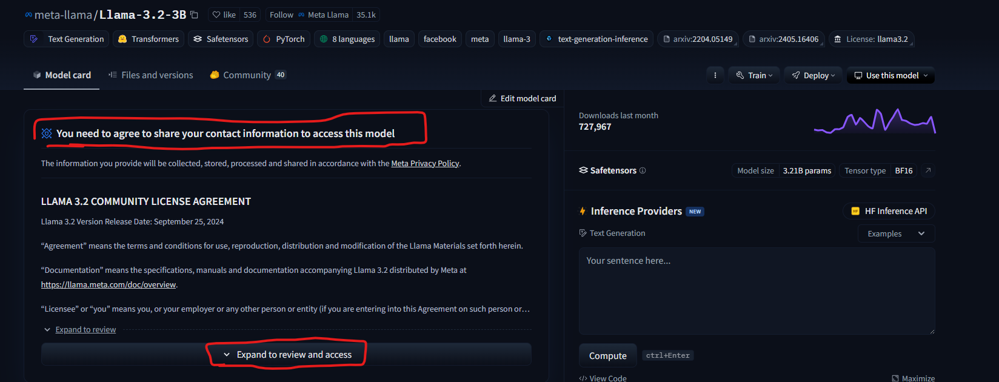
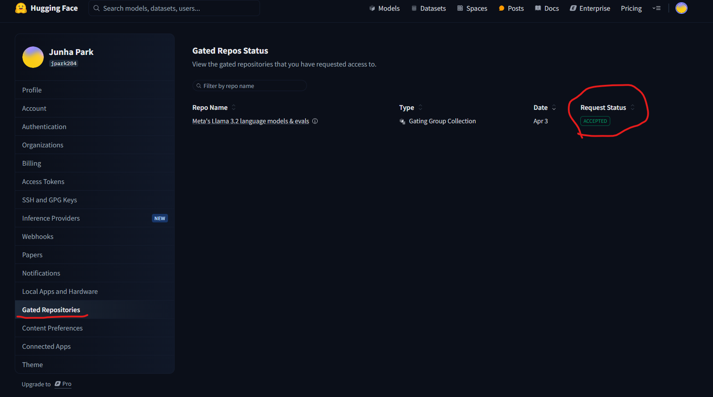

# python environment setting
### 1. cp ./cse476.yaml ~/cse476.yaml
### 2. cd ~
### 3. module load mamba/latest
### 4. mamba env create -n cse476 --file ~/cse476.yaml
### 5. source activate cse476

# huggingface transformers setting
1. Create Account for Huggingface
2. Grant Access for llama-3.2-3b (takes like 10min to get access)

    you can check request status(setting -> Gated Repo)

3. Get HuggingFace Access Token (Setting -> Get Access Token)
4. Copy and paste your Access Token to config.py
5. run main.py and test it
