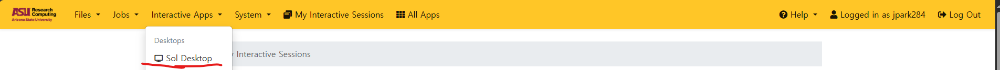
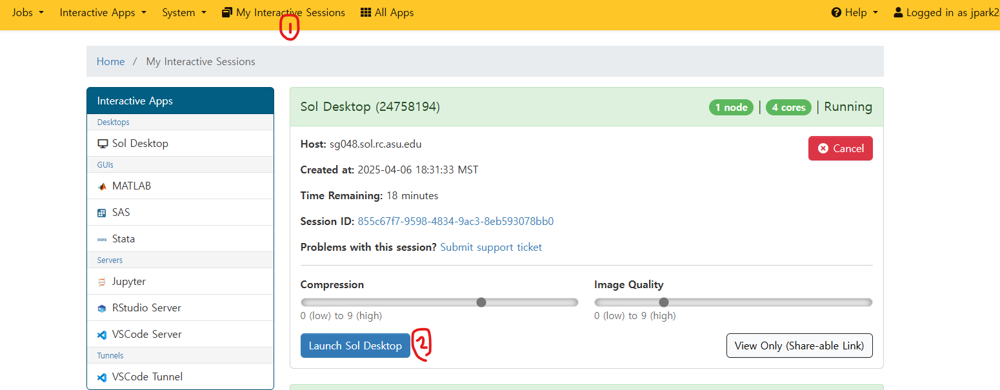

# CSE476 Project Documentation

## Setup

### 1. Python Environment Setup

1. Copy the configuration file:
   ```bash
   cp ./cse476.yaml ~/cse476.yaml
   ```
2. Navigate to the home directory:
   ```bash
   cd ~
   ```
3. Load the Mamba module:
   ```bash
   module load mamba/latest
   ```
4. Create the Python environment:
   ```bash
   mamba env create -n cse476 --file ~/cse476.yaml
   ```
5. Activate the environment:
   ```bash
   source activate cse476
   ```

### 2. Hugging Face Transformers Setup

1. Create an account on Hugging Face.
2. Request access to `llama-3.2-3b` (approval may take about 10 minutes).
   
   You can check the request status under Settings -> Gated Repo.
   
3. Obtain a Hugging Face Access Token (Settings -> Get Access Token).
4. Copy the template configuration file:
   ```bash
   cp ./Backend/config_temp.py ./Backend/config.py
   ```
5. Paste your Access Token into `config.py`.

### 3. Dependency Installation

1. After activating the Python environment, you should see `(cse476)` in your terminal.
   
2. Install the required libraries:
   ```bash
   pip install -r requirements.txt
   ```
3. Once the installation is complete, the code is ready to run.

---

## Training

### 1. Accelerate Configuration

Before training the model, configure `accelerate` by running the following command:

```bash
accelerate config --config_file accelerate_config.yaml
```

- The `accelerate_config.yaml` file is located in the project root and can be modified to suit your environment.
- Default settings include `bf16` mixed precision and GPU usage.

### 2. Running SFT Training

Run the `train_sft.sh` script to train the SFT (Supervised Fine-Tuning) model:

```bash
sbatch train_sft.sh
```

- The `train_sft.sh` script uses the Slurm workload manager to execute training tasks.
- It calls `train_sft_inst.py` or `train_sft_general.py` or `your python training code` to handle dataset loading, model setup, and training parameters.

### 3. Fine-Tuning with a New Dataset

If you are fine-tuning with a new dataset, you need to attach the previous adapter to the base model and save a new adapter after training. Below is an example workflow:

#### Step 1: Load the Base Model and Previous Adapter

```python
from transformers import AutoModelForCausalLM, AutoTokenizer
from peft import PeftModel, get_peft_model

# Load base model
base_model = AutoModelForCausalLM.from_pretrained("meta-llama/Meta-Llama-3-3B")
tokenizer = AutoTokenizer.from_pretrained("meta-llama/Meta-Llama-3-3B")

# Attach the previous adapter
previous_adapter_path = "path_to_previous_adapter"
model = PeftModel.from_pretrained(base_model, previous_adapter_path)
```

#### Step 2: Fine-Tune the Model

Use the loaded model to fine-tune on the new dataset. Ensure that the training script (`train_sft_general.py` or `train_sft_inst.py`) is configured to use the new dataset.

#### Step 3: Save the New Adapter

After training, save the new adapter to a specified directory:

```python
new_adapter_path = "path_to_new_adapter"
model.save_pretrained(new_adapter_path)
tokenizer.save_pretrained(new_adapter_path)
```

### 4. Key Training Scripts

#### `train_sft_inst.py`

- **Dataset Loading**: Uses `inst_DatasetLoader` to load and combine Alpaca and Dolly datasets.
- **LoRA Configuration**: Defines LoRA parameters via `LoRA_config`.
- **Training Parameters**:
  - `num_train_epochs`: 2
  - `per_device_train_batch_size`: 8
  - `gradient_accumulation_steps`: 4
  - `learning_rate`: 2e-4
  - `logging_steps`: 10
- **Model Saving**: Saves the trained model and tokenizer to the specified directory.

#### `train_sft_general.py`

- **Dataset Loading**: Processes and loads the FLAN dataset.
- **LoRA Configuration**: Defines LoRA parameters via `LoRA_config`.
- **Training Parameters**:
  - `num_train_epochs`: 1
  - `per_device_train_batch_size`: 4
  - `gradient_accumulation_steps`: 8
  - `learning_rate`: 1e-4
  - `logging_steps`: 50
- **Model Saving**: Saves the trained model and tokenizer to the specified directory.

---

## Evaluation

### 1. Loading Adapters

To load a trained adapter, use the following code snippet:

```python
from transformers import AutoModelForCausalLM, AutoTokenizer
from peft import PeftModel

# Load base model
base_model = AutoModelForCausalLM.from_pretrained("meta-llama/Meta-Llama-3-3B")
tokenizer = AutoTokenizer.from_pretrained("meta-llama/Meta-Llama-3-3B")

# Load adapter (choose one)
adapter_name = "sft_a_d"  # Replace with the desired adapter folder name
model = PeftModel.from_pretrained(base_model, f"gg-cse476/gg/{adapter_name}")

# Example usage
input_text = "Hello, how can I assist you today?"
inputs = tokenizer(input_text, return_tensors="pt")
outputs = model.generate(**inputs)
print(tokenizer.decode(outputs[0], skip_special_tokens=True))
```

### 2. Test LLM API

1. Open [sol.asu.edu](https://sol.asu.edu).
2. Create a new desktop session.
   
3. Open the desktop session.
   
4. Open two terminals in the desktop session and activate the `cse476` Python environment in both terminals.
5. In the **Backend** folder, run the following command in the first terminal (this starts the LLM API server):
   ```bash
   uvicorn main:app --host 0.0.0.0 --port 8000
   ```
6. In the **frontend** folder, run the following command in the second terminal (this starts the client):
   ```bash
   python server.py
   ```
7. Open Firefox and navigate to:
   - [http://127.0.0.1:5000](http://127.0.0.1:5000) or [http://localhost:5000](http://localhost:5000)
8. You will see a chat interface where you can test the application.

---
### Hugging Face Repository

All adapters are hosted on the Hugging Face repository:  
[https://huggingface.co/gg-cse476/gg](https://huggingface.co/gg-cse476/gg)

Visit the repository to explore and download the adapters.

## Additional Notes

- Ensure all dependencies are installed before running the application.
- All commands should be executed within the `(cse476)` environment.
- Modify the `accelerate_config.yaml` file to adjust the training environment as needed.
- Refer to the README files in each directory for additional details and troubleshooting.